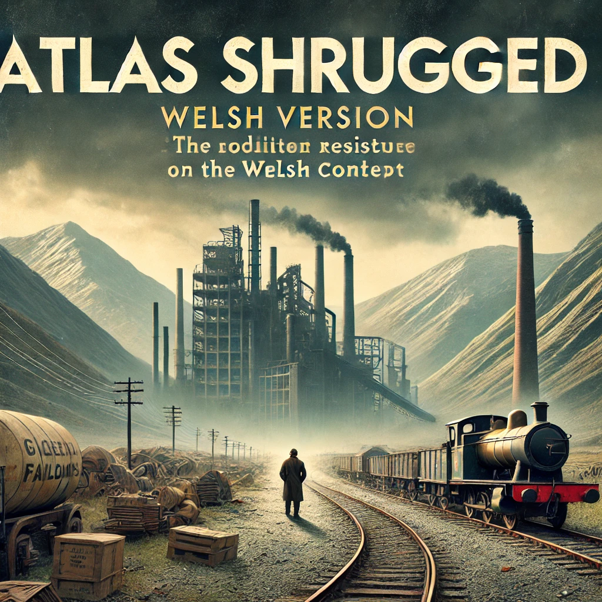

`atlas shrugged but set in Wales`

If *Atlas Shrugged* were reimagined and set in Wales, the story would unfold against the backdrop of the country's distinctive landscape, history, and industry. Here’s how some elements might translate into a Welsh setting:

### 1. **Industrial Decline and Resource Control:**
   The steel industry of Port Talbot and the coal mines of South Wales could serve as the economic backbone, much like the railroads and steel industries in Ayn Rand’s original. Welsh entrepreneurs and inventors would be pitted against government policies that stifle innovation. The battle would center on industries once considered Wales' pride, now being slowly suffocated by heavy regulation and crumbling infrastructure.

### 2. **Characters:**
   - **Dagny Taggart’s Equivalent:** A determined and resourceful woman who runs a major Welsh rail or logistics company, possibly modernizing old mining infrastructure for new technologies.
   - **John Galt’s Equivalent:** An inventor from a tech startup in Cardiff, frustrated by taxes and regulations, who goes underground, gathering the best minds of Wales to abandon society's demands.
   - **James Taggart’s Equivalent:** A bureaucrat or politician, perhaps involved in managing the failing Nationalized Railways of Wales, benefiting from inefficiency and government subsidies while hindering progress.
   
### 3. **Galt’s Gulch in Wales:**
   Instead of the Rocky Mountains, the secretive haven for innovators would be nestled in Snowdonia or in a hidden valley in the Brecon Beacons. This enclave could serve as a high-tech hideaway for Wales' brightest minds, away from the prying eyes of a government that seeks to control innovation.

### 4. **Transport System Collapse:**
   The railways and highways in Wales, such as the M4 corridor, would be plagued by neglect and bureaucratic control, leading to traffic jams, infrastructure collapse, and increasing reliance on poorly maintained transport systems. Iconic Welsh tunnels and bridges could become choked and in disrepair, reflecting the slow grind to stagnation.

### 5. **Symbolism of Wales’ Natural Beauty:**
   Welsh mountains, rivers, and coastline would symbolize the beauty and potential of an unregulated, free society, but these elements would be contrasted with the industrial decay and government overreach in urban areas like Cardiff, Swansea, or Newport.

### 6. **Cultural Context:**
   A Welsh version of *Atlas Shrugged* would likely include discussions of cultural identity, particularly the role of Welsh language and history in the tension between local control and centralized British or European policies. Some characters might seek to preserve Welsh tradition, while others embrace modern technological libertarianism, reflecting the novel's central theme of individualism versus collectivism.

### 7. **Social Commentary:**
   - The novel could explore how the Welsh government’s interventions—such as public ownership, green energy initiatives, or welfare programs—impact local entrepreneurs.
   - The rural-urban divide in Wales might be a point of conflict, with rural communities embodying independence and resilience, while cities like Cardiff symbolize centralized power and inefficiency.
  
In this version of *Atlas Shrugged,* Wales would be both a victim of overbearing government and a symbol of what could be achieved if people were left free to innovate, create, and thrive independently.