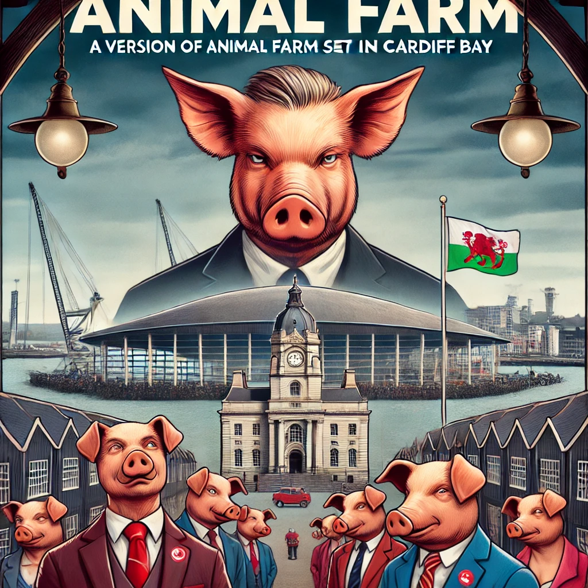
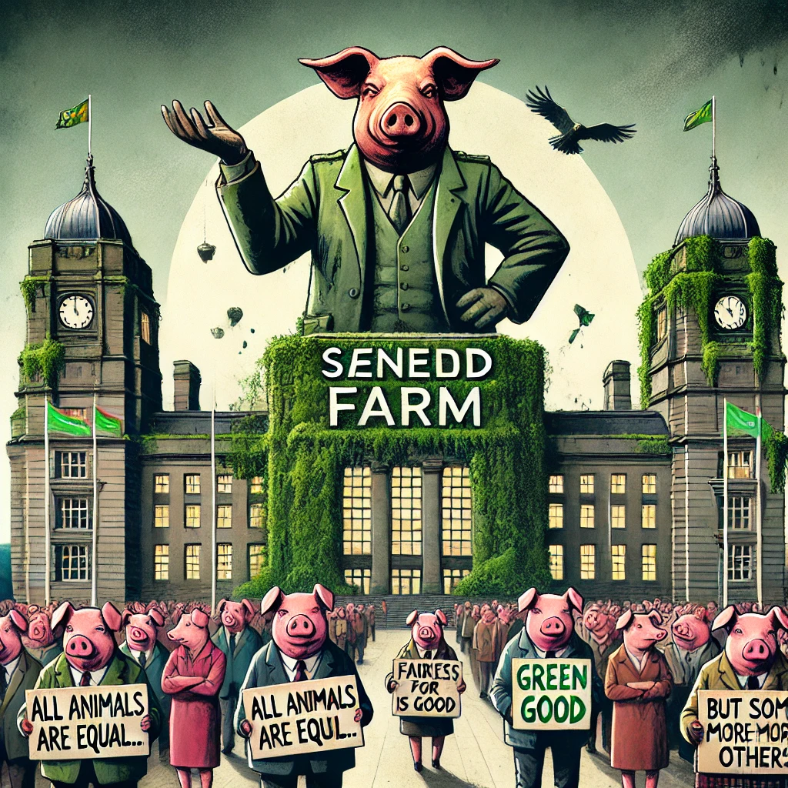
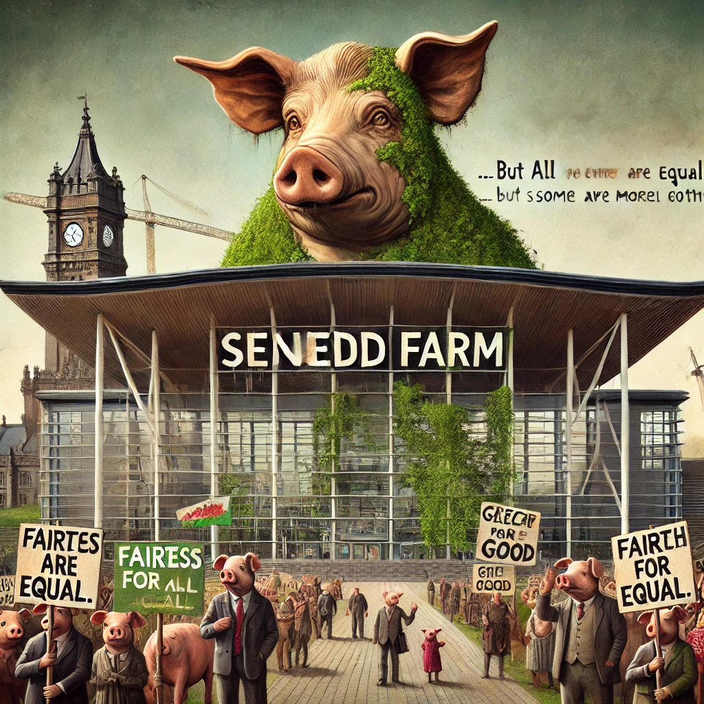
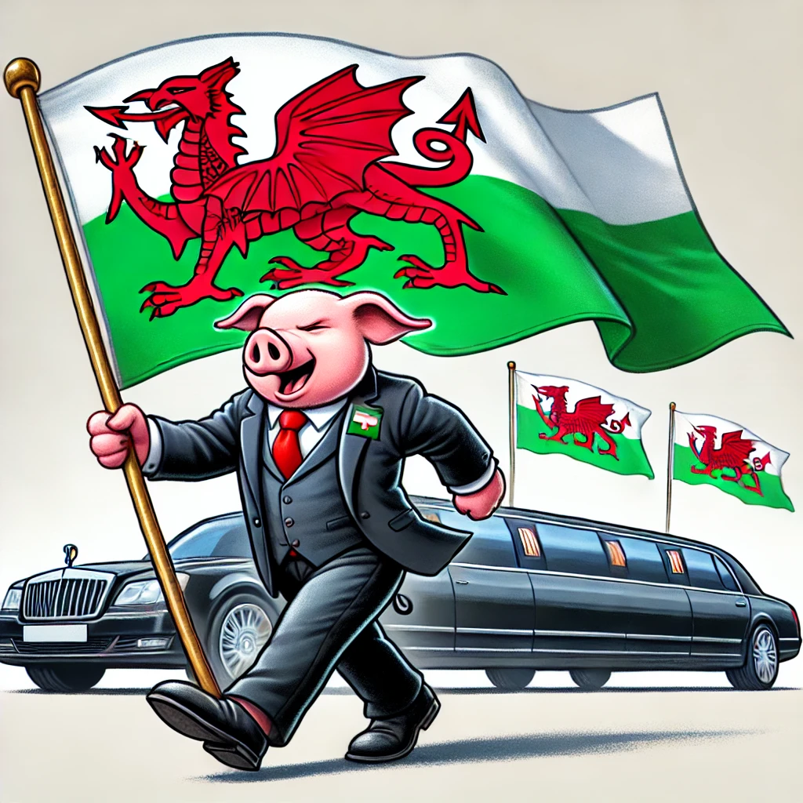

`Animal farm set in the senedd, Cardiff bay`

Imagining George Orwell’s *Animal Farm* set in the Senedd (Welsh Parliament) in Cardiff Bay adds an intriguing layer of political satire, reflecting the tensions, ambitions, and struggles of contemporary governance in Wales. Here’s how this adaptation could play out:

### **Title: "Senedd Farm"**

### Setting:  
The story is set in **Cardiff Bay**, where the Senedd, a modern building representing Welsh democracy, is transformed into a political "farm" of power struggles and ideological battles. The Welsh political leaders—representing a range of parties—are depicted as animals, just like in Orwell's original, with each animal symbolizing a different political force or leadership style.

---

### **Main Characters**:

#### **The Pigs** (The Political Elite)
The pigs in *Animal Farm* represent those in power who, after promising equality and fairness, slowly become indistinguishable from the oppressors they once overthrew. In *Senedd Farm*, the pigs are the Welsh political elite—leaders who rise from humble backgrounds, promising change, but slowly begin to prioritize their own privileges and power over the interests of the people.

- **Napoleon**: The chief pig could be a fictional stand-in for a powerful figure in the Welsh government. He rises to control the Senedd, promising autonomy and progress for Wales, but soon begins to use power to enrich himself and maintain control.
- **Squealer**: The clever spin-doctor pig represents the communications arm of the leadership, constantly revising history, twisting facts, and justifying policy failures. Squealer might be depicted as a highly articulate politician or advisor who ensures the public remains loyal and confused through misleading information.

#### **The Sheep** (The Passive Followers)
The sheep in Orwell’s *Animal Farm* are easily led, blindly repeating slogans such as "Four legs good, two legs bad." In *Senedd Farm*, the sheep could symbolize the unquestioning supporters of the political establishment, who repeat party slogans or support policies without fully understanding the consequences. Their favorite chant might be:

*"Twenty’s plenty, it’s fair and true."*  
or  
*"Tax the rich, they owe it too!"*

#### **Boxer** (The Working Class)  
Boxer, the hardworking horse in *Animal Farm*, represents the diligent, loyal, working class who trust the system and believe that hard work will lead to a better future. In *Senedd Farm*, Boxer would represent the Welsh public—miners, steelworkers, teachers—who believe in the promises of prosperity and equality, even as they see their industries collapse, wages stagnate, and the promises of devolution unfulfilled.

Boxer’s tragic mantra might be:

*"I will work harder… devolution is the way."*

#### **The Dogs** (Enforcers)
In *Animal Farm*, the dogs are the private security force of the pigs, ensuring that anyone who opposes the ruling elite is suppressed. In *Senedd Farm*, the dogs could represent enforcement bodies or political lobbyists, who ensure that political opponents, protestors, and critics are marginalized or silenced. They maintain order but do so with force and threats, ensuring dissent is never too strong.

---

### **Plot**:

The animals in *Senedd Farm* rise up in a political revolution against the perceived “English oppressors,” demanding greater autonomy for Wales. They call for local governance, full devolution, and a fairer society, free from the grip of Westminster.

At first, it’s a utopia—new policies are passed, and promises of wealth and prosperity flow through the Senedd. The animals believe that at last, they will have full control over their destiny. Slogans like **"Equal Wales for All"** and **"Power to the Valleys"** echo through the chamber.

However, over time, the pigs—who have taken control of the Senedd—begin to consolidate power. They enjoy privileges that the other animals do not. Secret deals are struck, and more and more funds are diverted to maintain their control rather than improve the lives of the animals.

#### **Key Moments**:

1. **The Speed Limit Debate (20 mph)**:  
The pigs introduce a sweeping 20 mph speed limit across Wales, claiming it will save lives and promote fairness. The sheep loudly support it, chanting "Twenty’s plenty!" However, Boxer, who relies on driving to get to work, struggles with the new rules. While the pigs and elite enjoy the benefits of chauffeured cars, Boxer finds himself stuck, his livelihood threatened by the very policies meant to help him.

2. **The Collapse of Industry**:  
Under the pigs’ rule, major Welsh industries like steel and mining begin to crumble. Boxer and the working animals are told that sacrifices must be made for a “greener Wales.” While the animals tighten their belts, the pigs quietly sign deals to sell off parts of the land for corporate investment, ensuring their personal fortunes grow while the working class suffers.

3. **Protests in Cardiff Bay**:  
As the situation worsens, dissent begins to rise among the animals. They gather outside the Senedd to protest poor wages, the loss of industry, and rising taxes. However, the dogs (enforcers) are unleashed to break up the demonstrations, and Squealer spins the situation, claiming the protests were “foreign agitators” trying to destabilize Wales.

4. **Changing the Rules**:  
Just like in *Animal Farm*, the pigs begin to change the rules of governance. They introduce vague amendments and pass secret laws, always ensuring that they remain in power. One day, Boxer notices that the once-prominent slogan **"All Animals Are Equal"** has been quietly altered to **"All Animals Are Equal, But Some Are More Equal Than Others."**

---

### **Climax**:

In the final act, the animals realize that the pigs have made secret deals with international corporations and Westminster, trading away key parts of Welsh autonomy in exchange for personal power and security. The pigs now live in luxury, while the animals are worse off than before.

Boxer, who has always believed in the promises of the Senedd, is injured while working. He hopes for help from the pigs, who had promised to care for every animal. Instead, Boxer is quietly taken away, sold off in a deal that ensures the pigs receive even more funds to maintain their control.

As Boxer is taken away, the remaining animals gather in front of the Senedd to protest, but they are met by Squealer and the dogs, who insist that everything is fair and that the pigs are still fighting for equality.

The novel ends with the pigs hosting a grand dinner in the Senedd, attended by powerful figures from London and beyond. The animals peer through the windows, unable to tell the difference between the pigs and the humans.

---

### **Themes**:
- **Power Corrupts**: The core theme of *Senedd Farm* is the corrupting influence of power. The pigs, once idealistic revolutionaries, slowly become just as oppressive and self-serving as the rulers they replaced.
- **Devolution and Nationalism**: The story satirizes the promises of political devolution and nationalism, showing how even local powers can become corrupt if not held accountable.
- **Inequality**: Despite promises of equality, the political elite in *Senedd Farm* enjoy privileges that ordinary citizens do not. The animals work harder for less while the pigs enrich themselves.
- **Control of Information**: The role of Squealer emphasizes how those in power manipulate information to keep control over the populace, ensuring that protests, discontent, and failure are always spun in favor of the ruling class.

---

### Conclusion:
*Senedd Farm* is a biting satire on power, governance, and the dangers of political elites promising change but delivering oppression. Just like Orwell’s original, it reflects the slow but inevitable transformation of revolutionary ideals into self-serving governance, all while those at the bottom suffer under the weight of their rulers' ambitions.

`Elaborate more. Especially about green issues, port talbot, transport failures and the collapse of the NHS. Comment on leadership contests and the importance of token virtue signalling over proven talent and competence…`

Expanding *Senedd Farm* to include more detailed commentary on key Welsh political issues like green energy policies, the decline of industries such as Port Talbot steelworks, transport failures, the NHS collapse, and leadership contests adds significant depth to the satire. Let’s delve into how each of these themes could be woven into the story, with a particular focus on how tokenism and virtue signaling replace genuine competence and leadership.

---

### **The Green Issues: "The Windmills of Virtue"**

One of the central themes of *Senedd Farm* could be the pigs' obsession with green energy initiatives, presented as their crowning achievement in creating a "sustainable" Wales. They tout massive investments in wind turbines, solar panels, and other green projects, often at the expense of real economic stability.

#### **The Green Promises**:
The pigs, led by **Napoleon** and supported by **Squealer**, promise the animals that Wales will lead the world in green energy. They announce plans to replace all coal, gas, and nuclear power stations with wind farms and solar energy. Squealer, in his role as chief propagandist, constantly broadcasts updates about how the green revolution will bring endless prosperity to Wales.

However, the animals on the farm start noticing the cracks in this utopia. While the pigs live in well-heated homes powered by hidden diesel generators, the animals experience regular blackouts. At night, the wind turbines stand still, and the solar panels sit useless under cloudy Welsh skies.

- **Boxer** (*representing the working class*), who worked in the now-shuttered coal mines and steelworks, can no longer heat his barn or power his tools. "Perhaps I don’t understand it," he tells himself, "but the pigs say this is for the best." Boxer repeats his mantra: *“I will work harder,”* even though he’s no longer sure what he’s working for.

- **The Sheep**, unquestioning as always, echo Squealer’s slogans: *“Green is good! The wind will provide!”* But as the animals shiver through another cold winter with no power, the reality becomes clear: the pigs’ green revolution is built on empty promises.

#### **The Collapse of Port Talbot Steelworks**:
One of the most tragic stories in *Senedd Farm* is the fall of **Port Talbot Steelworks**. This proud symbol of Welsh industry, represented by **Boxer** and other hardworking animals, is shut down in favor of “sustainable” alternatives. The pigs explain that heavy industries like steel are “archaic” and “bad for the environment.” In reality, they have struck secret deals with foreign companies to sell off what’s left of Port Talbot for personal profit.

- **Boxer’s Decline**: Boxer, who worked at the steelworks, is now left with no purpose. "We must reduce emissions," the pigs tell him, "for the sake of the planet." As Boxer is forced into early retirement, his health deteriorates. He had believed that his loyalty and hard work would ensure his place in the new Wales, but in the end, he is discarded when his usefulness ends.
  
- **The Pigs’ Hypocrisy**: Meanwhile, Napoleon and his inner circle continue to enjoy luxuries like imported steel and energy. In secret meetings with human executives, they sell off pieces of Welsh infrastructure, enriching themselves while telling the animals that the sacrifices are "for the good of the planet."

---

### **Transport Failures: "The Great 20 mph Plan"**

As part of their efforts to create a “fairer” and “greener” Wales, the pigs institute sweeping reforms across the nation’s transportation system. One of their most lauded policies is the introduction of a universal **20 mph speed limit** on all roads, framed as a way to reduce accidents and make roads safer for animals.

- **The Policy's Impact on the Animals**: While the pigs tout the policy as a major achievement, the reality for the animals is very different. With the transport system already crumbling, reduced speeds mean that it now takes even longer for the animals to get to work. Delivery times for food and supplies are delayed, causing shortages. Public buses, which are already unreliable, become unbearably slow. **Boxer**, who needs to travel to the outskirts of the farm to trade goods, is constantly late, his work slowing to a halt.
  
- **The Sheep’s Support**: As always, the **Sheep** blindly support the pigs’ policies. They chant, *“Twenty’s plenty!”* at every public gathering. But their support is purely symbolic—they don’t understand the full consequences of the policy.

- **The Real Beneficiaries**: The pigs, of course, don’t abide by the new laws themselves. They travel in well-maintained, chauffeured vehicles, bypassing the 20 mph limit altogether. They have special passes that allow them to use restricted roads, justifying this as "necessary for the proper functioning of government."

---

### **The Collapse of the NHS: "Health for the Few"**

In *Senedd Farm*, the pigs proudly announce that they are expanding access to healthcare for all animals under their new **Farm Health System**. At first, this sounds like a great achievement: every animal, regardless of their position, will receive free healthcare.

However, as time goes on, the reality of the Farm Health System is revealed:

- **Overcrowded Clinics and Waiting Lists**: The clinics are understaffed and underfunded. Animals needing urgent care are placed on long waiting lists. **Boxer**, who has injured his leg working at the steelworks, waits for months to see a doctor. By the time he is finally seen, it’s too late—the injury has worsened, and he can no longer work. **Mollie**, the horse who previously worked as a symbol of animal beauty, can no longer get her treatments for her health problems either.

- **The Pigs’ Private Healthcare**: Unbeknownst to the other animals, the pigs have created their own private healthcare system, using funds skimmed from public health resources. They get immediate access to the best treatments, while the rest of the animals suffer in overburdened clinics.

- **Token Virtue Signaling**: Whenever the animals protest the collapsing healthcare system, **Squealer** issues statements filled with meaningless platitudes, declaring, "The health of all animals is our top priority." He introduces new buzzwords like "health equity" and "access for all," but in practice, these mean nothing. The pigs are more concerned with appearances than real improvements.

---

### **Leadership Contests: "Competence Abandoned for Popularity"**

As the farm’s infrastructure collapses, the pigs regularly hold **leadership contests** to determine who should govern the farm. But instead of focusing on real qualifications or achievements, the contests are based on **popularity** and **virtue signaling**.

- **Token Leaders**: The pigs select candidates for leadership based not on their competence, but on how well they can signal the right virtues. The winners are those who best recite slogans about equality, sustainability, and fairness. Meanwhile, genuinely talented and competent animals are sidelined or ignored. **Benjamin**, the wise but cynical donkey, is overlooked for leadership because he refuses to engage in empty rhetoric.

- **Public Displays of Virtue**: Candidates for leadership spend most of their time performing public acts of virtue—planting trees for photo opportunities, or making speeches about their "deep concern" for the environment. However, they never actually follow through with policies that would improve the lives of the animals.

- **Squealer’s Role in Manipulation**: **Squealer** ensures that every leadership contest is skewed in favor of the pigs’ chosen candidates. He uses the farm’s media channels to smear opponents and promote the pigs’ favorites. He rewrites history, framing past failures as triumphs, and dismisses criticisms as "unpatriotic."

---

### **Virtue Signaling Over Proven Competence: "The Appearance of Progress"**

In *Senedd Farm*, the pigs become masters of **virtue signaling**, constantly promoting their image as benevolent leaders while achieving nothing of substance. Every policy is framed as an act of moral virtue, even when it has disastrous consequences.

#### **Examples of Virtue Signaling**:
1. **The Green Economy**: The pigs regularly make speeches about how they are "leading the world" in green energy, but the reality is that the wind turbines barely work, and the animals are freezing in their barns.
2. **Equality and Fairness**: The pigs hold rallies celebrating "equality," yet they live in luxury while the other animals are starving. They create "equality boards" and "fairness committees," but these bodies do nothing except issue reports filled with jargon and platitudes.
3. **Health Initiatives**: Whenever the NHS collapses further, the pigs respond with token gestures like holding health fairs or distributing pamphlets on wellness. They announce a "Five-Year Plan for Animal Health," which never materializes into anything tangible.

---

### **Climax: The Final Betrayal**

In the final scenes of *Senedd Farm*, the animals realize that the pigs have been slowly selling off the farm's resources to outside interests, all while maintaining the illusion of local control. **Boxer**, once the farm’s most loyal worker, is sold to a private contractor when he is no longer of use, despite promises that he would be cared for in retirement.

The pigs, now indistinguishable from their human counterparts, enjoy the benefits of their secret deals, while the rest of the animals languish in poverty, waiting for the next hollow promise of "reform" from their leaders.

---

### Conclusion: The Fall of Senedd Farm

*Senedd Farm* ultimately serves as a biting critique of modern political leadership. The story

`Add something about the “nation of sanctuary” initiative on which no one had a vote and the determination of school standards as the curriculum is changed.`

To add to the satire of *Senedd Farm*, we can weave in elements of the **“Nation of Sanctuary” initiative** and the **education reforms** involving curriculum changes and the erosion of school standards, all driven by the same tokenism and virtue signaling that permeates the pigs' leadership. These elements will amplify the theme of how governance driven by symbolic gestures often fails to address the real concerns of the animals on the farm. Let's explore these issues in depth within the story's framework.

---

### **The Nation of Sanctuary: “A Safe Haven for All”**

In *Senedd Farm*, one of the central initiatives introduced by the pigs is the creation of a **"Nation of Sanctuary"**. This initiative, heralded as a symbol of the farm’s moral superiority, is promoted as a groundbreaking policy designed to make the farm a safe haven for all animals from across the world, regardless of their origins or circumstances.

#### **The Unanimous Announcement**:
- The pigs gather all the animals to proudly declare that **Senedd Farm** will now be known as a "Nation of Sanctuary." **Napoleon** leads the charge, claiming that this policy will show the world how compassionate and open-minded the farm is. However, the decision is made without consulting the animals, and no vote is held. 
- **Boxer** and the other animals are confused. They have not had a say in the matter, and although they support the idea of fairness and safety, they wonder how the farm will accommodate the influx of new animals when resources are already stretched thin. 

- **Squealer**, as usual, spins the decision as an unquestionable good. “The sanctuary will benefit all animals! It’s our duty to share what we have!” But the reality soon becomes clear: the farm’s infrastructure is already crumbling, and the pigs have no real plan to support the increased population.

#### **The Consequences**:
- While the pigs hold public ceremonies welcoming new animals, the existing population is increasingly frustrated. Resources such as food, shelter, and health services are already scarce, and the farm’s health system (modeled on the failing NHS) is on the verge of collapse.
- The **sheep**, as always, repeat the slogans fed to them by the pigs: *“We’re all equal! Sanctuary for all!”* But the **other animals**—especially **Boxer** and the **hens**—struggle to understand why the pigs continue to make grand promises while ignoring the farm’s basic needs. "We have no vote, yet we must live with this," Boxer thinks, confused by the pigs' decisions.

- Behind closed doors, the pigs make deals with powerful figures in other farms, using the **Nation of Sanctuary** to curry favor with international leaders and enhance their own standing. They appear at global conferences, basking in the praise of other farms, while the animals back home suffer from worsening conditions.

#### **Tokenism Over Real Policy**:
- The **Nation of Sanctuary** becomes another symbol of virtue signaling over practical governance. The pigs don’t care about the well-being of the new animals or the existing population—they care about appearing virtuous and gaining international prestige. 
- Whenever the animals complain about the strain on resources, **Squealer** responds with moral lectures, saying, *"Would you turn away those in need? This is what makes us great!"* The debate is shut down, and any animals who question the policy are branded as selfish or lacking compassion. There’s no room for honest discussion about how the farm can realistically handle this influx of new arrivals.

---

### **The Decline of Education: “The Farm Curriculum”**

Another central theme in *Senedd Farm* is the pigs' attempt to reshape education to suit their ideological goals. To ensure that future generations of animals remain loyal to their vision, the pigs introduce sweeping **curriculum changes** in the farm’s schools. This initiative, called **The Farm Curriculum**, is presented as a way to modernize education and bring fairness and equality to all animals.

#### **The Curriculum Reform**:
- The pigs introduce a new curriculum that emphasizes "fairness," "social justice," and the history of the **Great Revolution** (which brought the pigs to power). Instead of focusing on practical skills that would help the animals, like farming techniques, industrial knowledge, or healthcare, the curriculum becomes a tool for indoctrination.
  
- **Reading and writing** are de-emphasized in favor of loyalty to the farm’s leadership. Classes focus on the greatness of the pigs' rule and the virtue of their policies, particularly the green energy initiatives and the Nation of Sanctuary.

- **Benjamin**, the cynical and intelligent donkey, observes this with dismay. "These animals," he mutters to himself, "will learn nothing of use."

#### **Lowering Standards for Ideological Control**:
- Standards in education drop drastically. Instead of promoting hard work, curiosity, and competence, the pigs reward **blind loyalty**. Students who excel in memorizing the **Squealer-approved slogans** are given high marks, while those who question the system are penalized.
  
- For instance, in a class on **agriculture**, students are no longer taught practical farming skills. Instead, they are told how great the farm’s green policies are and how farming can only be improved by **"reducing animal impact"** (a thinly veiled excuse to hide the failures of the farm’s agricultural policies).
  
- **Mollie** the horse, who once prided herself on learning new skills, becomes frustrated. Her efforts to improve her reading and knowledge of farming are ignored by the pigs, who promote students based on their ability to parrot official rhetoric rather than their actual abilities.

#### **Tokenism Over Talent**:
- **The pigs** introduce policies that claim to bring “fairness” and “equity” to education, but these policies are designed to mask their incompetence and inability to provide a high-quality education. **Real talent and competence** are overlooked in favor of students who praise the leadership.

- The pigs implement **quotas** for advancement, ensuring that **certain groups** of animals are promoted regardless of merit. This is framed as a victory for “inclusivity,” but in reality, it prevents talented animals like **Boxer’s offspring** from advancing. They are discouraged from working hard, as they see that loyalty to the pigs, rather than talent, determines success.

#### **A New Generation of Followers**:
- The pigs' strategy works: a new generation of animals, having grown up under the reformed curriculum, become **unquestioning followers** of the pigs. They have been trained to accept the farm’s policies without thought, and when they enter the workforce, they blindly support whatever the pigs tell them. **Critical thinking is suppressed**, and loyalty is rewarded above all else.

- The pigs take advantage of this, introducing **leadership contests** where the winners are not the brightest or most capable, but those who can best perform **public virtue signaling**. Animals like **Benjamin**, who are cynical and see through the pigs' lies, are sidelined, while those who follow the pigs' agenda are promoted.

---

### **Leadership Contests: "Competence vs. Popularity"**

The pigs hold **regular leadership contests** to give the appearance of democracy, but in reality, these contests are nothing more than popularity contests. Talent and competence are irrelevant; what matters is who can perform the most effective **virtue signaling**.

#### **The Contest**:
- Every few years, the animals are allowed to vote for a new leader, but the choices are always limited to the pigs and their loyalists. The pigs ensure that no real alternative voices are ever allowed to rise.
  
- Candidates are judged not on their competence or ability to improve the farm, but on how well they can **perform public gestures of virtue**. One pig might plant a **single tree** and hold a grand ceremony about the importance of the environment. Another might deliver an impassioned speech on the **Nation of Sanctuary**, pledging even more resources despite the farm’s ongoing collapse.

- The animals who run the day-to-day operations of the farm—those who actually understand how to grow crops, raise animals, and fix broken machinery—are completely ignored. **Boxer**, despite his hard work and loyalty, is never considered for leadership because he does not possess the **rhetorical flair** that the pigs demand.

#### **Virtue Signaling Over Competence**:
- The pigs use these leadership contests to **distract** the animals from the real issues on the farm. Instead of focusing on the collapsing industries, failing transport systems, or declining healthcare, the pigs keep the animals occupied with meaningless debates about **"who is the most compassionate"** or **"who cares most about fairness."**

- **Competence** is seen as less important than **public performance**. Even animals who express frustration with the declining conditions are told that they should be **grateful** for the pigs’ leadership, because they are **"on the right side of history."**

- The **pigs** ensure that any challengers who dare question their rule are discredited. When **Benjamin** criticizes the education system or the Nation of Sanctuary initiative, **Squealer** publicly attacks him as **"reactionary"** or **"selfish."** The pigs have mastered the art of **deflection**, turning every valid criticism into a moral attack.

---

### **Final Collapse: A Farm in Ruins**

By the end of *Senedd Farm*, the farm is in a state of near-collapse. The **green energy policies** have left the animals without consistent power. The **Nation of Sanctuary** has strained the farm’s already-depleted resources. The **education system** has produced a generation of unskilled animals who only know how to follow orders. And the constant **leadership contests** have ensured that the most talented and competent animals are left out

`Cover art for the book please`

A satirical book cover for 'Senedd Farm', a reimagining of George Orwell's Animal Farm set in the Welsh Senedd in Cardiff Bay. The cover shows an imposing building resembling the Welsh Senedd, overgrown with vines, symbolizing decay and failed leadership. In front of the building, animals such as pigs in suits and sheep are seen holding protest signs with slogans like 'Fairness for All' and 'Green is Good'. A large, bronze statue of a pig, standing in a commanding pose, looms over the scene. The title 'Senedd Farm' is bold and prominent, using a modern font, with a subtitle 'All Animals Are Equal... But Some Are More Equal Than Others'. The colors are muted, with a mix of greens and browns, evoking the themes of decay and corruption.

A satirical book cover for 'Senedd yr Anifeiliaid', a reimagining of George Orwell's Animal Farm set in the Welsh Senedd in Cardiff Bay. The cover prominently features the modern Welsh Senedd building in a state of disrepair, with vines growing over its glass and steel structure, symbolizing decay. In front of the building, animals such as pigs in suits and sheep are holding protest signs. A large bronze statue of a pig stands in a commanding pose near the Senedd building. The title 'Senedd yr Anifeiliaid' is displayed boldly, with the subtitle 'All Animals Are Equal... But Some Are More Equal Than Others.' The color palette includes muted tones of green, brown, and grey, emphasizing themes of corruption, decay, and failed leadership.

A playful cartoon of a pig in a suit, marching confidently in front of a limousine while holding a big red flag. The pig is dressed in a formal business suit, with a determined expression, as he leads the way with the flag fluttering in the air. Behind him, a sleek limousine follows, symbolizing wealth and power. The red flag is large and bold, contrasting with the pig's formal attire. The overall scene is humorous, combining elements of authority, symbolism, and satire.
